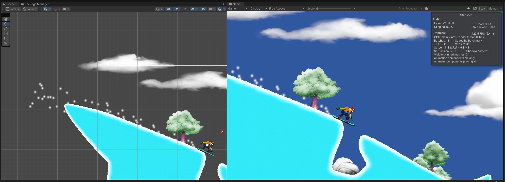

# Snow Boarder

Game made as part of the [Complete C# Unity Game Developer 2D](https://www.udemy.com/course/unitycourse/?couponCode=24T4MT90924B) tutorial series.

The game implements a simple snow boarding mechanic, with boosting, turning and win/lose states.

Controls:
 - Boost: ↑
 - Rotate: ← →

Objective: Get to the finish line by staying on your board to the end without hitting your head

Boosting greatly increases your speed, allowing for better jumps!

[//]: # (TODO Ideas:)
[//]: # (- Menu system on start and death)
[//]: # (- Animations)
[//]: # (- Music and sound effects)
[//]: # (- Hoops to jump through?)
[//]: # (- Randomly generated terrain?)
[//]: # (- Better rotation feel?)
